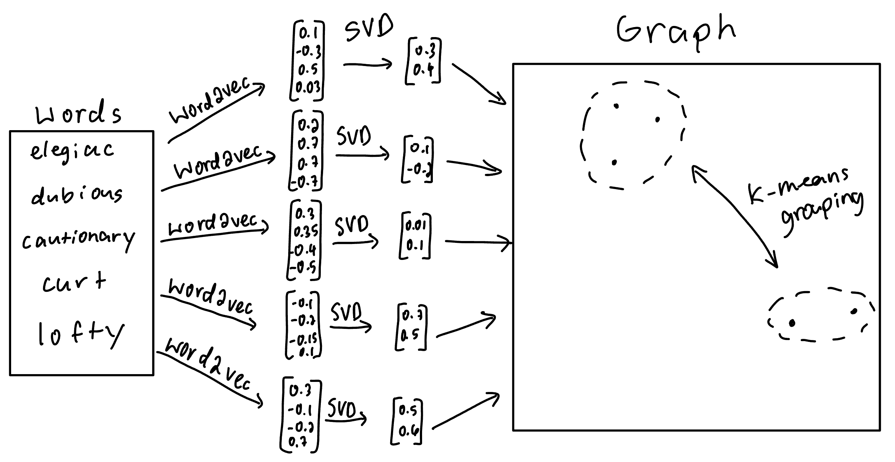
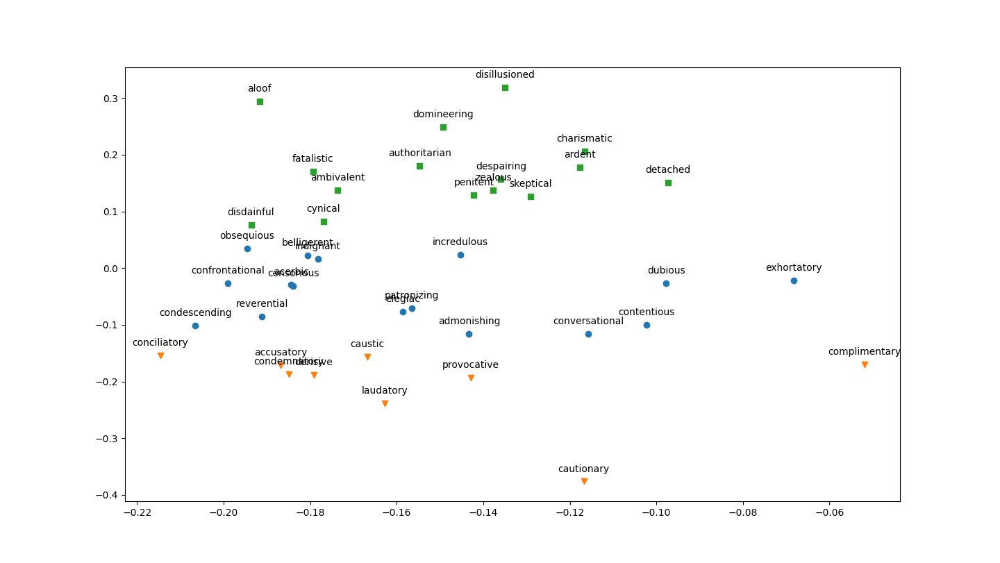

# Semantic Analysis


## Description
This is a program which can group words semantically based on word embeddings from [`gensim`](https://radimrehurek.com/gensim/)'s word2vec model. We run the model over the words so that we obtain a vector and then we apply [singular value decomposition](https://en.wikipedia.org/wiki/Singular_value_decomposition) (SVD) to the vectors, projecting them to two dimensions. With this, we can plot them on a graph. We then run a k-means clustering algorithm to group the words. Our hope is that words with similar semantic meaning will be close to each other, thereby being chosen to be in the same group. 

## How This Came To Be
We were in English class and we did not want to have to group words by their semantic meaning manually, so we made a a program to do it. 

## How To Run It
To install dependencies, run `pipenv install` if you have [pipenv](https://pipenv.pypa.io/en/latest/), or run `pip install -r requirements.txt` if you have pip. To run the program, run `preprocess.py` first as this creates the embedding vectors for all the words. To obtain a plot of the words that shows the different groups by different point types, run `plot.py`.<br/><br/>If you want to try using different words other than the ones present currently, you must modify the `wordlist` variable in `preprocess.py`.

## Examples
```
$ python3 preprocess.py
$ python3 plot.py
```
